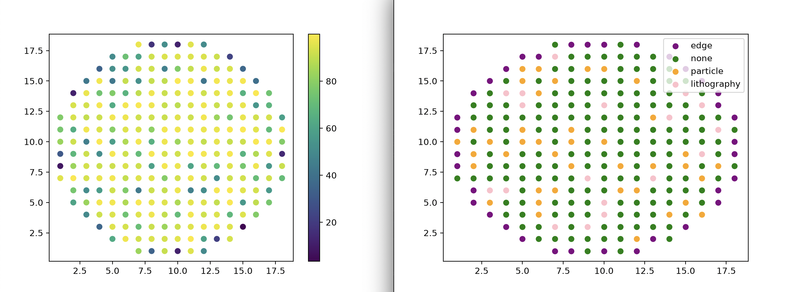

# Wafer Defect Simulator Version 1

A synthetic simulation of a circular semiconductor wafer with individually modeled dies, randomized manufacturing defects, and performance analysis.

**Note:** This is a synthetic model, not a physically accurate fab simulation. It's meant to demonstrate data modeling, numpy/pandas analysis, and visualization — not real semiconductor physics.

## What it does

- Generates a circular wafer boundary within a grid, correctly excluding grid positions that fall outside the physical wafer.
- Assigns each valid die a defect type: `none`, `particle`, `lithography`, or `edge` — with `edge` defects weighted to occur more often near the wafer boundary.
- Assigns a performance score to each die based on its defect type.
- Computes yield (% of dies passing a performance threshold) and defect counts.
- Visualizes the wafer as a scatter plot, colored by performance score and by defect type.

## How to run

1. Install dependencies:
   ```
   pip install -r requirements.txt
   ```
2. Run the script:
   ```
   WaferSimulator_v1.py
   ```

## Example output



## Possible future additions

- Weighted edge-risk as a probability modifier rather than a separate defect category
- Interactive visualizations
- Additional defect types
